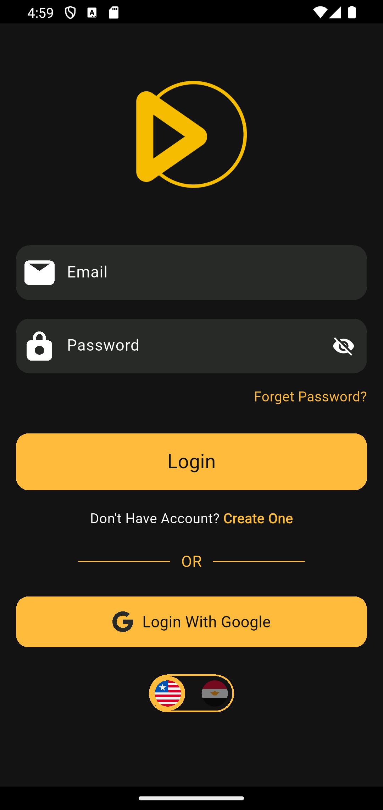
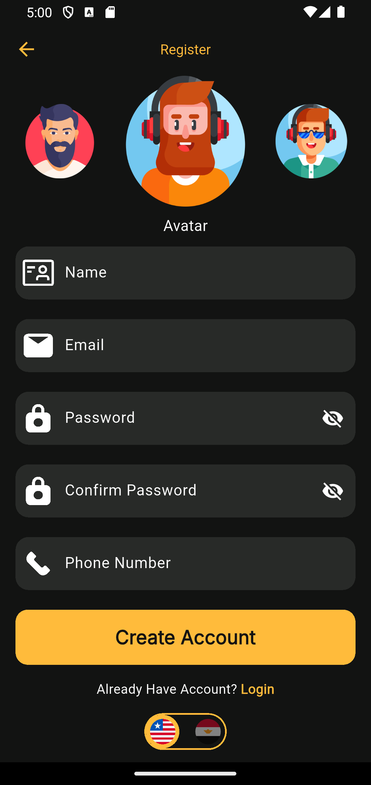
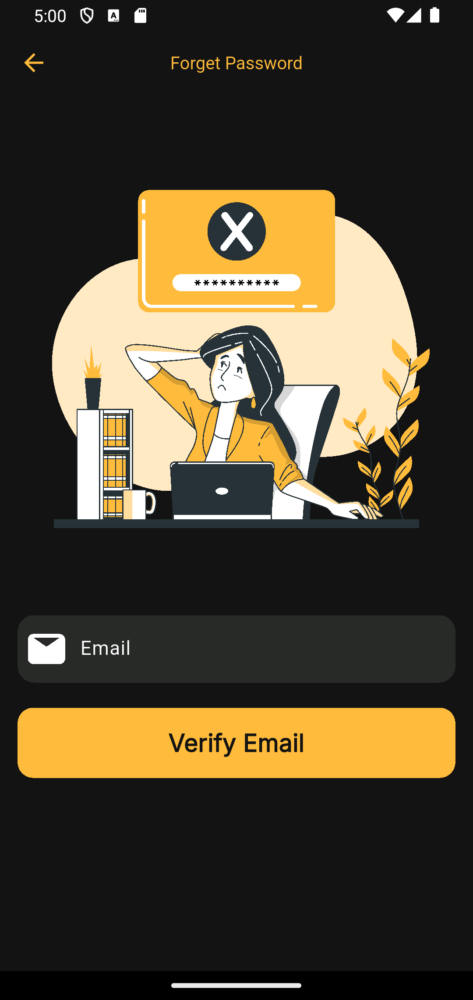
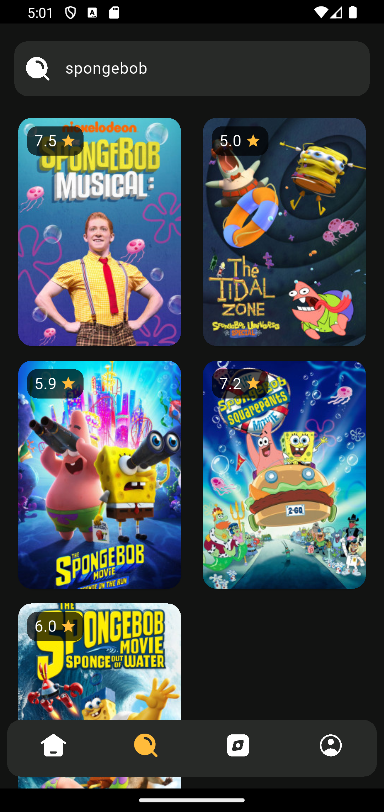
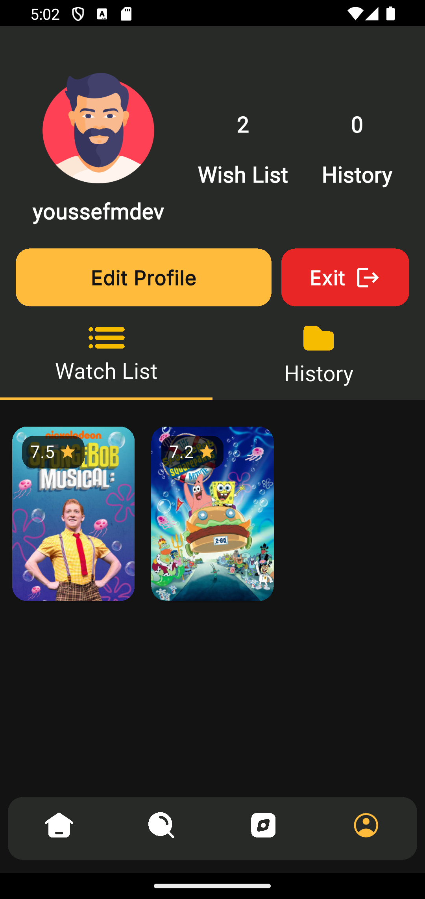
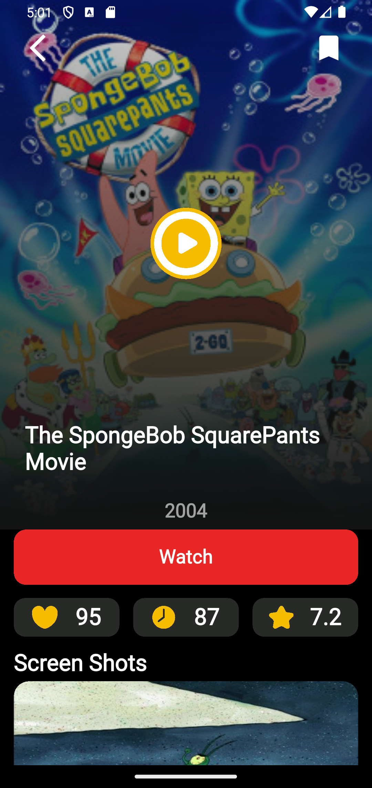
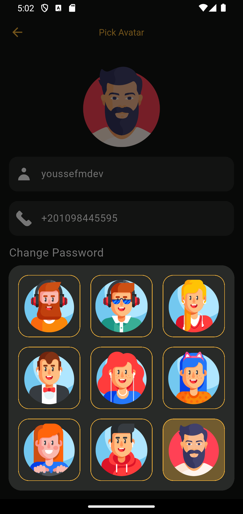

# 🎬 Movie App
A modern Flutter movie app that brings movie browsing, favorites, smart search, and profile management into a single smooth experience.

# 📋 Project Overview
A production-ready Flutter movie app that showcases clean architecture, modular design, and real-world features such as authentication, movie browsing, favorites, search, and profile management.​
The app integrates a custom movie API (YTS) for content and a separate backend for user management, delivering a full-stack experience with robust error handling and offline support for watch history via Hive.​

# 📸 Screenshots
| Login | Register | Forget Password |
| ------------ | ------------ | ------------ |
|  |  |  |

| Home | Home Categories | Search |
| ------------ | ------------ | ------------ |
|  |  |  |

| Categories | Profile |
| ------------ | ------------ |
|  |  |

| Movie Details | Edit Profile | Language Feature |
| ------------ | ------------ | ------------ |
|  |  |  |

# 🛠️ Tech Stack
- Framework: Flutter, Dart, Flutter ScreenUtil, Flutter Native Splash​
- State Management: Bloc / Cubit with custom BlocObserver​
- Networking: Dio, Connectivity Plus​
- Backend APIs: Auth, profile, favorites, Movies, search, details, suggestions
- Storage: Hive (local movie history), SharedPreferences (token, language)​
- Auth & Identity: Firebase Core, Firebase Auth, Google Sign-In​
- Dependency Injection: Injectable, get_it (configureDependencies() in di/di.dart)​
- Localization: l10n with LocalCubit (Arabic/English switch)​
- UI & Assets: Custom theme, typography system, SVG icons, PNG images, carousel slider, cached network images​

# 🏗 Architecture
The project follows a Clean Architecture style with a clear separation between presentation, domain, and data layers, combined with DI and feature-based organization.​

**Presentation Layer**
- Flutter UI screens in features/ (auth, onboarding, home, search, explore, profile, movie details, update profile).​
- Bloc/Cubit classes per feature (e.g. HomeCubit, SearchCubit) for state and business flow.​

**Domain Layer**
- Use cases such as GetCarouselMoviesUseCase, GetGenreUseCase, GetSearchUseCase, and movie details use cases.​
- Entities decoupled from API models (e.g. LoginResponseEntity, MovieDetailsResponseEntity, ProfileEntity).​

**Data Layer**
- Remote data sources using Dio and strongly typed models for movies, favorites, auth, profile, search, and change password.​
- Offline data source for history using Hive boxes.​
- Error abstraction using Failure, ServerError, and NetworkError, frequently wrapped in Either from dartz.​

# ✨ Features

**Authentication & Onboarding**
- Email/password registration and login with validation and token persistence.​
- Forgot password / change password flow via backend endpoint.​
- Google Sign-In powered by Firebase Auth and google_sign_in.​
- Onboarding and welcome screens with gradient backgrounds and custom illustrations.​

**Movie Discovery**
- Home screen with a carousel of top-rated movies and horizontal lists by genre.​
- Detailed movie page with runtime, rating, genres, description, screenshots, cast, and similar movie suggestions.​

**Search & Explore**
- Search with pagination and infinite scroll via SearchCubit and YTS API.​
- Explore tab to browse movies by genres from a predefined genre list.​

**Favorites & History**
- Add/remove movies to/from favorites using secure token-based endpoints.​
- Get all user favorites and check if a movie is favorited.​
- Local watch history stored in Hive with a dedicated offline data source.​

**Profile & Settings**
- Profile view bound to backend profile entity.​
- Update profile (name, phone, avatar) and delete profile via API.​
- Language switcher (Arabic/English) with persistence via LocalCubit and SharedPreferences.​

**UI/UX & Utilities**
- Consistent theme, color system, fonts (Roboto, Inter, Poppins), and style helpers.​
- Reusable widgets: custom buttons, text fields, dialogs, loading indicators, and movie cards.​
- Bottom navigation bar with SVG icons and animated movie carousel.​

# 📂 Folder Structure

```
lib/
├─ api/
│  ├─ api_constant.dart
│  ├─ api_manager.dart
│  ├─ end_points.dart
│  └─ errors/
├─ core/
│  ├─ customized_widgets/
│  ├─ resources/        # colors, fonts, styles, assets
│  ├─ routes_manager/   # routes, RouteGenerator
│  └─ utils/            # constants, prefs, validation, bloc observer
├─ data/
│  ├─ data_sources/
│  │  ├─ remote_data_sources/
│  │  ├─ offline_data_source/
│  │  └─ *.dart         # abstract data source contracts
│  ├─ model/            # DTOs & adapters
│  └─ ...               # favorites, profile, movies, auth models
├─ domain/
│  ├─ entities/
│  ├─ repositries/
│  └─ use_cases/
├─ features/
│  ├─ auth/
│  ├─ onboarding/
│  ├─ welcome/
│  ├─ home_screen/
│  ├─ update_profile/
│  └─ ...
├─ l10n/
├─ di/
└─ main.dart
```

# 🚀 How to Run the Project

1. Clone the repository

```
git clone https://github.com/FatmaFarred/movie_app_route_graduation_project
```

2. Install dependencies

```
flutter pub get
```

3. Generate code (for injectable and any annotations)

```
flutter pub run build_runner build --delete-conflicting-outputs
```

4. Run the app

```
flutter run
```

# 👨‍💻 Contributors
- [Youssef Mohamed](https://github.com/youssefmdev22)
- [Fatma Farred](https://github.com/FatmaFarred)
- [Ahmed Salah](https://github.com/AhmedSalah1811)
